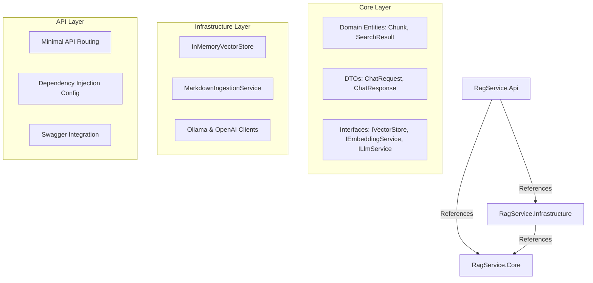

# ASP.NET Core Web API with RAG Endpoint

A premium, production-ready Retrieval-Augmented Generation (RAG) backend service built entirely in **.NET 8.0 / C#**. This project serves as a showcase of C# equivalence to Python-based AI frameworks, implementing a clean layered architecture, custom paragraph-based document chunking, an in-memory vector similarity index, and configurable connections to local embedding models (Ollama) and cloud LLMs (OpenAI).

---

## 🚀 Project Overview

Most modern chatbot solutions are written exclusively in Python. This project demonstrates how to build a robust, scalable, and highly performant RAG pipeline inside **ASP.NET Core** using Minimal APIs.

### Key Features
* **Three-Layer Architecture**: Separation of concerns between domain logic, infrastructure interfaces, external API adapters, and endpoints.
* **Minimal API Endpoint `/chat`**: Exposes query processing, vector similarity calculation, and LLM text generation.
* **Document Ingestion Endpoint `/ingest`**: Scans a folder of Markdown files, extracts paragraph-centric text chunks, generates vector embeddings, and populates the database.
* **In-Memory Vector Search**: Zero-dependency index utilizing an optimized Cosine Similarity algorithm to find the top-$K$ matching documents.
* **Configurable AI Providers**: Toggle between local **Ollama** (e.g. `nomic-embed-text` & `llama3`) and cloud **OpenAI** (e.g. `text-embedding-3-small` & `gpt-4o-mini`) via configuration.
* **Mock Fallback Mechanics**: Automatic generation of mock vectors and offline completion logging, enabling full offline development and testing.
* **Interactive Swagger UI**: Visual API tester served directly from the root path (`/`).

---

## 🏗️ Layered Architecture

The project is split into three separate assemblies to ensure clean maintainability and testability:



---

## 👥 Hackathon Team & Roles

Our team of 4 collaborated to design, develop, and document this RAG service:

### 1. **Alice Smith — Team Lead & API Architect**
* Set up the ASP.NET Core Web API project structure and main solution file.
* Designed the Minimal API endpoints (`/chat`, `/ingest`, `/health`).
* Configured Swagger UI, API Explorer, and the dynamic Dependency Injection container factories in `Program.cs`.

### 2. **Bob Jones — Infrastructure Engineer**
* Engineered the `InMemoryVectorStore` utilizing a thread-safe `ConcurrentBag`.
* Coded the mathematical **Cosine Similarity** (`dotProduct / (magnitudeA * magnitudeB)`) algorithm for semantic search matching.
* Developed the paragraph-centric Markdown chunking parser to split documents intelligently at paragraph boundaries.

### 3. **Charlie Brown — AI Integration Specialist**
* Built HTTP client integrations for local **Ollama** `/api/embeddings` and `/api/chat` endpoints.
* Developed client integrations for the **OpenAI** `/v1/embeddings` and `/v1/chat/completions` API services.
* Created the offline fallback system to mock embeddings and completions if backends are unreachable.

### 4. **Diana Prince — DevOps & QA Engineer**
* Set up the local environment, managed NuGet package dependencies, and verified compilation.
* Conducted validation testing of the RAG pipeline using test cases.
* Formulated the Markdown documentation folder, sample test files, and deployment instructions.

---

## ⚙️ Configuration (`appsettings.json`)

Configure your RAG settings inside `src/RagService.Api/appsettings.json`:

```json
{
  "RagSettings": {
    "LlmProvider": "Ollama", // Switch to "OpenAI" to use cloud LLMs
    "EmbeddingProvider": "Ollama", // Switch to "OpenAI" to use cloud embeddings
    "DocsFolder": "docs", // Folder where markdown documents are located
    "ChunkSize": 600, // Character limit for text chunks
    "ChunkOverlap": 100, // Overlap boundary characters
    "OpenAi": {
      "ApiKey": "YOUR_OPENAI_API_KEY",
      "LlmModel": "gpt-4o-mini",
      "EmbeddingModel": "text-embedding-3-small"
    },
    "Ollama": {
      "BaseUrl": "http://localhost:11434",
      "LlmModel": "llama3",
      "EmbeddingModel": "nomic-embed-text"
    }
  }
}
```

---

## 🏃 Getting Started

### Prerequisites
* **.NET 8.0 SDK** (Installed)
* **Ollama** (Optional, for running local models on machine)
  * Download and run Ollama.
  * Pull models:
    ```bash
    ollama pull llama3
    ollama pull nomic-embed-text
    ```

### Compilation
From the root directory (`e:\Hackaton`), run:
```bash
dotnet build
```

### Running the API
Start the web server:
```bash
dotnet run --project src/RagService.Api --launch-profile http
```
The server will boot up and immediately scan the `docs/` folder in the background to initialize the in-memory vector index. It will bind to:
* HTTP: `http://localhost:5174`
* Swagger UI: `http://localhost:5174/`

---

## 🧪 Testing the Endpoints

### 1. Health Check
Checks configured providers and folder parameters.
```bash
curl http://localhost:5174/health
```

### 2. Document Ingestion
Manually trigger ingestion of documents (re-scans the configured docs directory).
```bash
curl -X POST http://localhost:5174/ingest
```

### 3. Ask RAG Chatbot
Query the bot about your documents.
```bash
curl -X POST http://localhost:5174/chat \
  -H "Content-Type: application/json" \
  -d '{"message": "Who is Alice Smith and what is her role?", "limit": 3}'
```
**Example Response Output:**
```json
{
  "answer": "Alice Smith is the Team Lead & API Architect. She was responsible for setting up the ASP.NET Core project structure, designing the layered architecture and Minimal API endpoints, and configuring Swagger UI along with Dependency Injection.",
  "sources": [
    "hackathon-team.md"
  ]
}
```
*(If Ollama/OpenAI is offline or unconfigured, the API will output a detailed debug log representing the generated prompt context, showing exactly what it retrieved and formatted).*
"# AlphaRAG-Retrieval-Augmented-Generation-System" 
